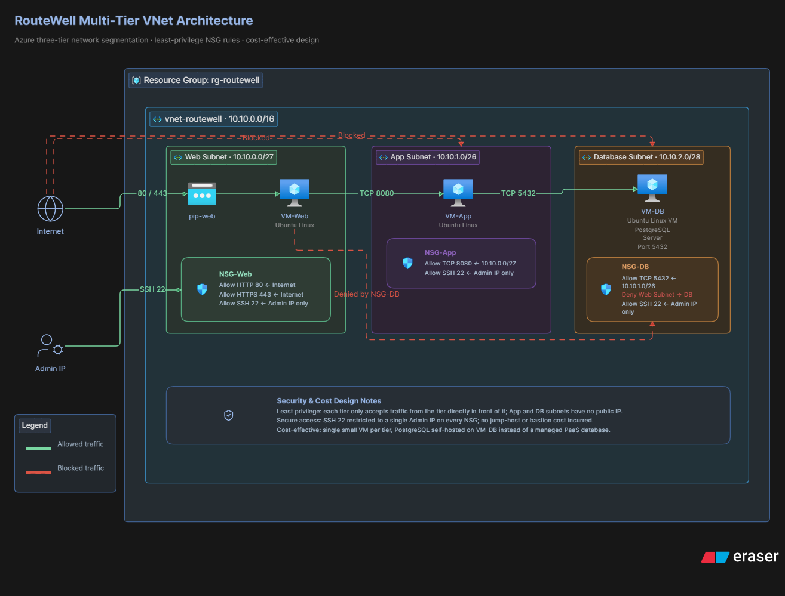

# RouteWell Multi-Tier VNet Architecture

## Overview
RouteWell is a regional logistics company that used to run its dispatch
web app, backend, and database on one flat network — a setup that once
put driver and customer records within reach of an unrelated
contractor's laptop. This project rebuilds RouteWell's network on
Azure as three isolated tiers (Web, App, Database), each with its own
subnet and its own least-privilege firewall rules, so the database can
never be reached from anywhere except the App tier — not even from
Web, and never from the internet.

## Architecture


| Tier | CIDR | Public IP | Purpose |
|---|---|---|---|
| Web | 10.10.0.0/27 | Yes (Standard, Static) | Public-facing dispatch web app |
| App | 10.10.1.0/26 | None | Backend application (port 8080) |
| Database | 10.10.2.0/28 | None | PostgreSQL, driver & customer records |

VNet: `vnet-routewell` (10.10.0.0/16), Resource Group: `rg-routewell`,
Region: `westeurope`.

## Prerequisites
- Azure CLI installed and logged in (`az login`)
- Git Bash on Windows — run `export MSYS_NO_PATHCONV=1` at the start
  of any session before running networking commands
- An SSH keypair at `~/.ssh/id_rsa` (generate with `ssh-keygen -t rsa
  -b 4096` if it doesn't exist)

## Deploy
```bash
bash scripts/deploy.sh
```
This builds the resource group, VNet, all three subnets, all three
NSGs and their rules, the public IP, all three NICs, and all three
VMs (`Standard_D2s_v3`) end to end from one script.

## NSG rule -> justification map

| NSG | Rule | Source | Port | Why |
|---|---|---|---|---|
| web-nsg | Allow-HTTP-HTTPS | Internet | 80, 443 | Public dispatch app must be internet-reachable |
| web-nsg | Allow-SSH | My admin IP only | 22 | Only externally reachable management path |
| app-nsg | Allow-Web-To-App | Web subnet (10.10.0.0/27) | 8080 | Web calling its backend |
| app-nsg | Allow-SSH | Web subnet (10.10.0.0/27) | 22 | Admin access via Web as jump host |
| app-nsg | Deny-Other-VNet-Inbound | VirtualNetwork | * | Closes Azure's default AllowVnetInBound gap |
| db-nsg | Allow-PostgreSQL | App subnet (10.10.1.0/26) | 5432 | App is the only tier permitted to reach the database |
| db-nsg | Allow-SSH | App subnet (10.10.1.0/26) | 22 | Admin access via App as jump host |
| db-nsg | Deny-Other-VNet-Inbound | VirtualNetwork | * | Explicitly blocks Web->DB |

## Testing
Screenshots in `/screenshots`:
- `test1-web-to-app.png` - Web -> App on 8080, succeeded
- `test2-app-to-db.png` - App -> DB on 5432, succeeded (via Web jump host)
- `test3-web-to-db-blocked.png` - Web -> DB on 5432, timed out (blocked)

## Incident
The `Allow-PostgreSQL` rule was deliberately misconfigured to simulate
a real-world typo, then diagnosed with `az network watcher
test-ip-flow` and fixed. Full write-up in
[`incident-report.md`](incident-report.md).

## Teardown
```bash
bash scripts/cleanup.sh
```
Prompts for the resource group name (`rg-routewell`) as confirmation
before deleting anything.
